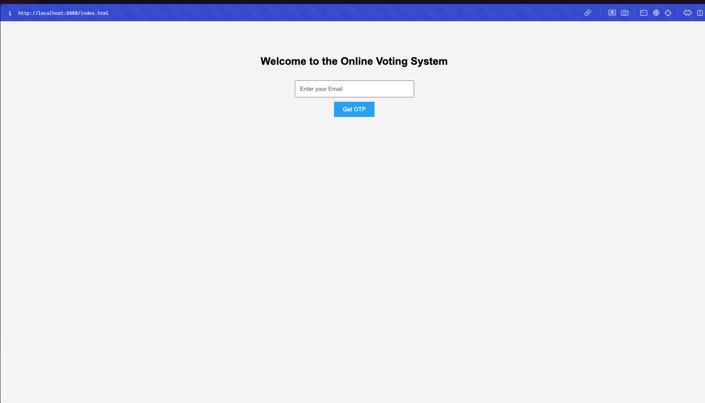

# 🗳️ Online Voting System

A secure and user-friendly web-based voting platform designed for student council elections.

## 🔧 Features
- OTP-based user authentication via Twilio
- Real-time vote tracking and logging
- Admin dashboard to manage candidates
- SQL-backed database for vote and user records

## 🛠️ Tech Stack
- PHP
- MySQL
- HTML/CSS
- Twilio API for OTP

## 📸 Screenshots

## 🧪 How to Run Locally
1. Clone the repository  
2. Import `sql/database_schema.sql` into your MySQL  
3. Update credentials in `config/db_config.php`  
4. Run with XAMPP or a local PHP server

## 📩 Contact
Created by Ritika Lamba  
[lambaritu67@gmail.com](mailto:lambaritu67@gmail.com)
